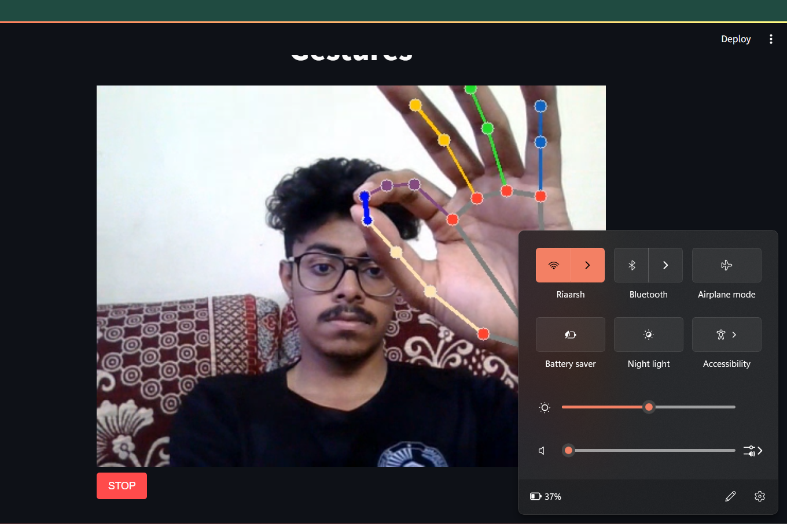
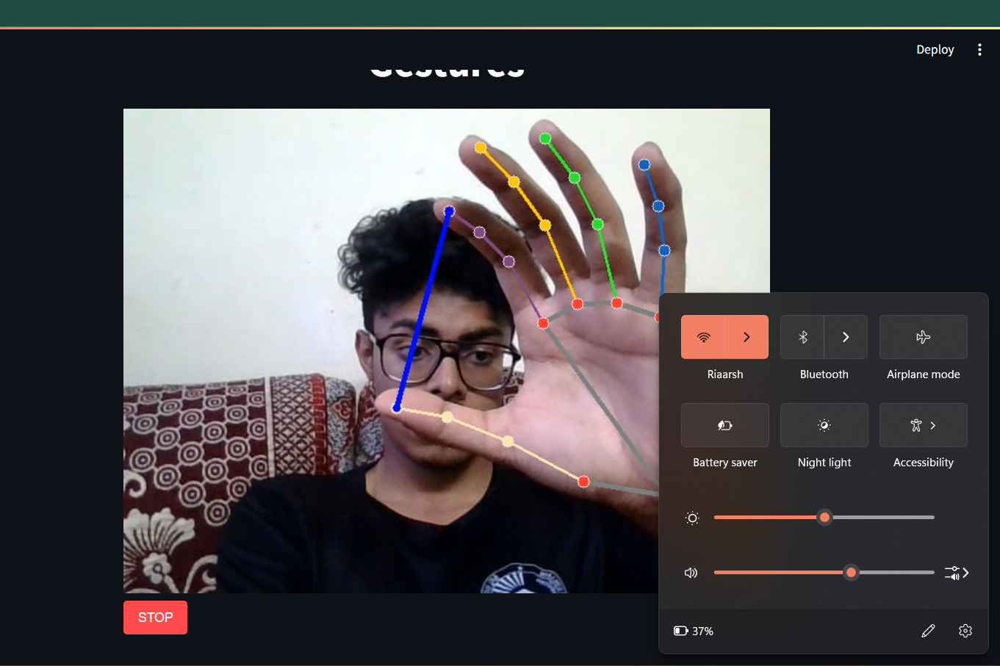
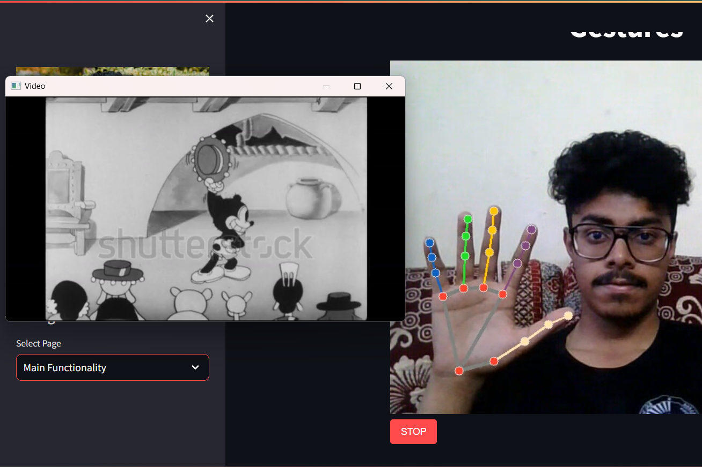
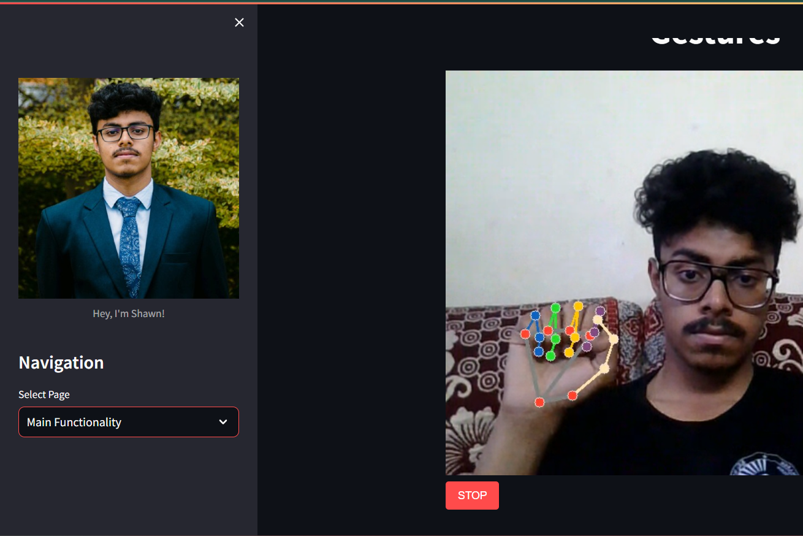

# Media Control with Hand Gestures

## Overview
Media Control with Hand Gestures is an innovative project that allows users to interact with media content using simple hand gestures. This project utilizes Python along with libraries such as MediaPipe, OpenCV, and Streamlit to create an intuitive interface for controlling media playback.

## Features
- Play/pause video with hand gestures.
- Control volume using hand gestures.
- Streamlined user interface powered by Streamlit.

## How to Use
1. **Prerequisites**: Ensure you have Python installed on your system along with the necessary libraries (`streamlit`, `opencv-python`, `mediapipe`, `pycaw`, `streamlit-webrtc`).
2. **Clone the Repository**: Clone this repository to your local machine.
3. **Install Dependencies**: Install the required dependencies by running `pip install -r requirements.txt`.
4. **Run the Application**: Run the application by executing `streamlit run app.py` in your terminal.
5. **Interact with Hand Gestures**: Follow the instructions displayed in the Streamlit interface to control media playback with hand gestures.

## Gestures and Actions
- **🖐️ Play/Pause**: Show your left palm to play the video. To pause, show your left fist.
- **👌 Volume Control**: Use your right hand to control the volume. Pinch in to decrease the volume, and pinch out to increase it.

## Screenshots

*Screenshot 1 - Decrease*

*Screenshot 2 - Increase*

*Screenshot 3 - Play*

*Screenshot 4 - Stop*

## About Me
This project is developed by ST.

---

**Note**: This project is for demonstration purposes only. For any issues or suggestions, please [submit an issue](https://github.com/2347253/mediagesturecontrol/issues).
